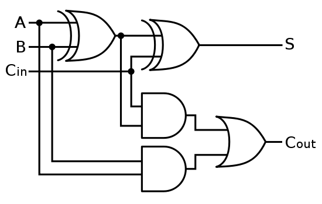

# What are computers?

*disclaimer: I know less than nothing about hardware and early computing. Any claims that I make in this lecture are probably incorrect in many ways. But, I'm really just trying to illustrate the simplicity which is compounded into magic which makes up a computer*

## Binary
In computers information is input, transferred, and stored as binary. Most of us know what binary looks like (`01101001`), binary is just a counting system with only two numbers, one and zero. We normally count with 10 numbers, we call this base-10, but you can use any number as a base to count, all it means is how many numbers go in the single digit column, binary is two, base-two. So in binary we start at 0, then count up increasing the columns every two numbers.

```
0
1
10
11
100
101
110
111
```

Note: we use 1 and 0 because they are familiar to use, but we could represent this with a and b, or anything else. For example any counting system over base-10 obviously can't depend on a number after 9, because one doesn't exist. In Hexidecimal (base-16) letters are used starting at 10:

```
1
2
3
4
5
6
7
8
9
a
b
c
d
e
f
10
```

If you've done any type of digital design you've probably seen color represented in hex values.

Ok, back to binary, the thing that makes binary special is that binary can easily be represented by electricity, low voltage and high voltage, or on/off.

So we can send electricity through a wire in different patterns to represent 1 and 0. Imagining Morse code being send over a long distance wire is similar to this, electricity is sent, which in some way triggers a noise for a human to hear, this human then interprets the noise according to a defined pattern.

The morse code example is kinda shady because it has one key part that is cheating when talking about technology, a **human** is interpreting, computers don't have the luxary of having a human to do all of it's logic. So how does a computer do logic?

## processor and gates

More electricity trickery. Using what are called gates very simple logic can be created. Gates are the hardware made up of transistors, a gate can be of many types which make up the different core logic operations, the most obvious are `and` and `or`. An `and` gate is made of two transistors which are wired in a way that if **both** of them have electricity flowing to them, then they allow electricity to continue to flow through, so if both power sources `a` **and** `b` have power, the gate allow the current to continue. While an `or` gate is wired in a way that if either `a` **or** `b` are powered electricity will continue to flow.

While this logic is simple, it can be build on top of each other to create more and more complex systems, when combined into a system like this, we call them circuits. As an example of the power of this, let's look at how computers can use these simple pieces to add numbers:



Long story short, geniuses extended these ideas and technologies until we had system which could carry out a whole slew of commands.

## Machine Code

Machine code is the literal binary (written as hex values) that the machine will execute.

```
50 00 48 50 00 71 50 00 6C 50 00 6C 50 00 6F 00
zz
```

## Assembly
Assembly is a the lowest level language, which abstracts the instructions off machine code into mnemonic codes to make writing the machine code more understandable to humans.

```
CHARO 0x0048, i; Output an ‘H’
CHARO 0x0071, i; Output an ‘e’
CHARO 0x006C, i; Output an ‘l’
CHARO 0x006C, i; Output an ‘l’
CHARO 0x006F, i; Output an ‘o’
STOP
.END
```

## C

C is a programming language that has implemented the Assembly commands into an easier, more extendable, and modular language. Before C operating systems like Unix may have been written in Assembly.

```
#include <stdio.h>
int main(int argc, char *argv[])
{
    puts("Hello");

    return 0;
}
```

## Ruby

Ruby is a language written in C, it implements a more human readable language to program in.

```
puts "hello"
```
