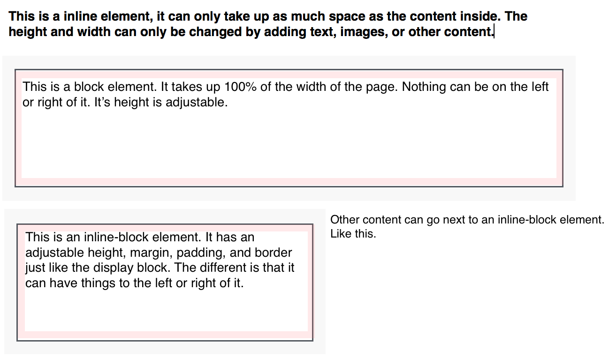

# HTML

### (Work in progress)

HTML (HyperText Markup Language), gives structure to the site by defining sections, for example, headings, paragraphs, or images.

Semantics
---------

Semantics in HTML is the practice of using valid HTML to give meaning to the webpage.
Semantic code describes what type of content is on the page. For example

```html
<h1>My Blog</h1>

<p>
  Lorem ipsum dolor sit amet, consectetur adipisicing elit, sed do eiusmod tempor incididunt ut labore et dolore magna aliqua. Ut enim ad minim veniam, quis nostrud exercitation ullamco laboris nisi ut aliquip ex ea commodo consequat.
</p>
```
The `<h1>` describes that the text "My Blog" is a heading for this page.

Display
-------

In HTML there are four display types `block`, `inline`, a cross of the two `inline-block`, and `none`.

Inline elements are elements that only take up the width of the actual content. Like this **bold** word, the html element `<b>` is used, but the elements width is automatically calculated.

Block elements are elements that take up 100% of the horizontal space they occupy, followed by a line break. Like the header at the top of this section.

Inline-Block elements are a combination of the two. Inline block elements are displayed inline but can have their widths changed.

----------------



----------------

Common Elements
-------

Headings are block level elements.

```html
<h1></h1>
<h2></h2>
<h3></h3>
<h4></h4>
<h5></h5>
<h6></h6>
```

Headings should be used in order (1-6) on the page. The `<h1>` element should be used for the primary heading on the page.

Don't use headings to just make the text bigger or bold. Use them to add meaning to the page.

```html
<div></div>
<span></span>
```

`div` and `span` are purely for building the structure of the site, they don't have any semantic meaning. `div` elements are block, while `span`s are inline.

- `<html>` Wraps **all** content within an HTML page.
- `<head>` Non content element, used purely to define configuration for the page such as the title in the tab, loading css, and other meta information.
- `<body>` Wraps all content meant to be viewable to the user.
- `<p>` Block level paragraph element. Used for chunks of text, often following a header element.
- `<strong>` Inline level element to imply that text is important. Styled with bold text.
- `<em>` Inline level element to emphasize text. Adds italic styling to the text.
- `` Used to add pictorial content, usually a jpeg, png, or gif.
- `<a>` Anchor tag, this is primarily used for hyperlinks to link to another webpage on the internet.
- `<div>` Block element used to build sections and structure .
- `<ul>` Unordered List, Block element used to begin a list (bullets).
- `<ol>` Ordered List, block element used to begin a list (numbered)
  - `<li>` Block element to add a list item to any type of list
- `<table>` Block element used for tabular data (not positioning)
  - `<tr>` Table Row, used within a table to add a row to the table
    - `<th>` Table Header, used within a table row to add a header cell
    - `<td>` Table Data, used within a table row to add a data cell

#### HTML5 structural elements:

- `<header>` Used as an element to hold page header information (logo, navigation, heading)
- `<nav>` Used as a container for navigational links
- `<article>` Used to distinguish text as self-contained content on some topic. Think the body of a blog post.
- `<section>` Used to identify a grouping of content. Like a section of articles.
- `<aside>` Used for "side" content such as sidebars, notes, or inserts.
- `<footer>` Identifies the content at the end of the page

For reference of these tags and more, refer to the [htmldog tag docs](http://www.htmldog.com/references/html/tags/).

Look at this [PDF](https://github.com/code-builders/curriculum/blob/master/html/word-doc.pdf) formatted using Word™, identify as many elements as possible that have HTML equivalents.

Choose one of the six following topics, in your work today take some extra time to research the element(s), be prepared to share your knowledge about the topic with the rest of the class:

- lists (ol/ul/nav)
- a/img
- table/thead/tr/th/td/tbody
- div/section/p
- h1-h6/em/strong
- head/title/meta
