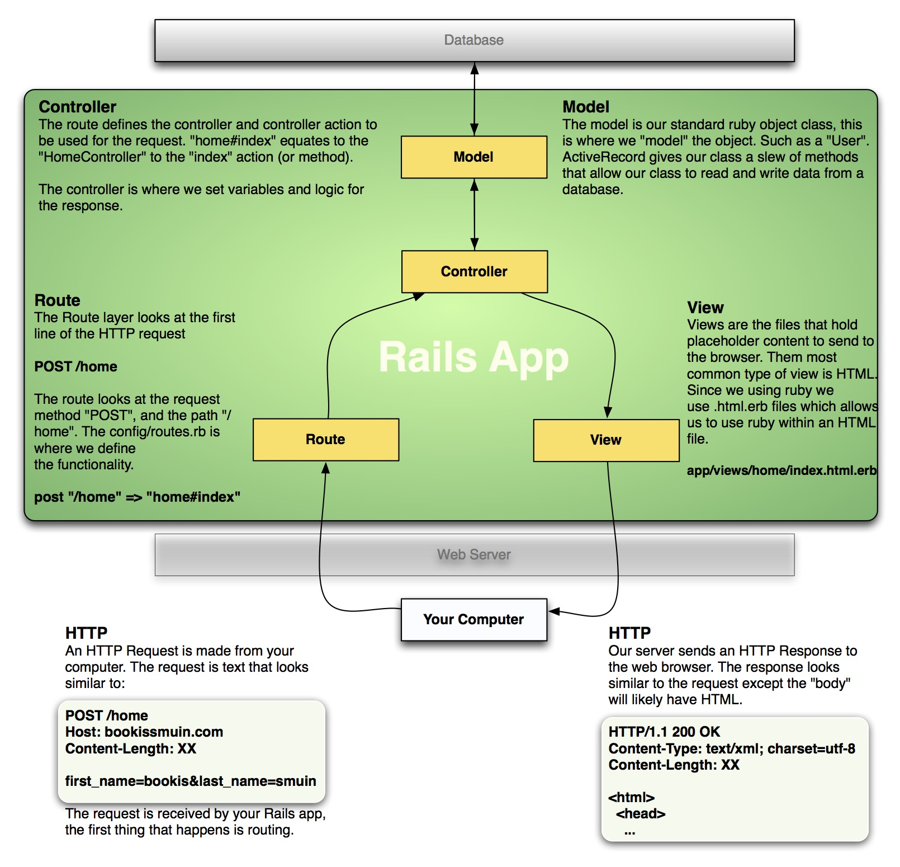

## Rails Controllers

Rails controllers are the second major component in a rails request and they are the brains of an application.  After a request is routed to our controller action, the controller is responsible for processing incoming data from the request and sending a response. The controller response generally involves retrieving or saving data to the database, and assembling data to use in the view.


### In this lesson we will learn about:

- Naming Controllers
- Instance variables
- ApplicationController

#### Naming Controllers

Controllers can have any name, but we have to name the file and class consitently. The file must have `_controller` in it and be be named using snake case, and the class must be named with the corresponding camel case name:

| name | filename | class name |
| :------------- | :------------- | :-------------        |
| home | home_controller.rb       |  HomeController       |
| far mar | far_mar_controller.rb |  FarMarController     |
| users | users_controller.rb |  UsersController     |

#### Instance Variables

Typically any variable we set in a controller action will be instance variables, this is because we typically want the variable to be available to our views. For instance if we want a username defined to be available to our view:

```rb
class HomeController < ApplicationController
  def index
    @user = "Bookis"
  end
end
```

Now in our view we can use erb tags to display this value.

```html
<h1>I'm <%= @user %></h1>

<a href="/">Go Home</a>
```

You can think of rendering a view as a method of an instance of a controller, just like a regular ruby class instance methods can be shared between methods, that same thing is happening for our controller/view. Variables are set in the method we define then when the method to render the view is used, those variables carry over to the view.

Any value can be assigned to an instance variable within the controller, then used within the view.

```rb
class HomeController < ApplicationController
  def index
    @user = "Bookis"
    @students = ["Daniel", "LeShoya", "Chris", "Evelyn", "Karen", "Tammy"]
  end
end
```


```html
<h1>I'm <%= @user %></h1>

<h2>Code Builders students:
<ul>
  <% @students.each do |student| %>
    <li><%= student %></li>
  <% end %>
</ul>
<a href="/">Go Home</a>

```
Instance variable can also be used in the application layout file.

```html
<!DOCTYPE html>
<html>
<head>
  <title>Bookis' steps to Rails</title>
  <%= stylesheet_link_tag    'application', media: 'all', 'data-turbolinks-track' => true %>
  <%= javascript_include_tag 'application', 'data-turbolinks-track' => true %>
  <%= csrf_meta_tags %>
</head>
<body>

<div>
  Hello <%= @user %>, welcome back.
</div>

<%= yield %>

</body>
</html>
```
#### render

The last thing our controller action does is send an HTTP response. _By default the controller action renders a layout with the same name as the action._

```rb
class HomeController < ApplicationController
  def index
    @user = "Bookis"
    # rendering the html view implicitly happens here
  end
end
```

The `index` action will render the `app/views/home/index.html.erb`, in this path `home` corresponds to the controller, and `index` corresponds to the action. But we can override this default behavior with the `render` method:

```rb
class HomeController < ApplicationController
  def index
    render :about_me
  end
end
```

The snippet above would render `app/views/home/about_me.html.erb`.  


[render guide](http://guides.rubyonrails.org/layouts_and_rendering.html#using-render)  

#### ApplicationController

Controllers inherit from `ApplicationController`, this file can be found in the `app/controllers/` dir. You can add additional functionality to your `ApplicationController` to share methods across all controllers. This is very common with things like determining if the user is logged in before displaying content, or finding the current user from the database.

```rb
class ApplicationController < ActionController::Base
  ...

  def current_user
    "Bookis"
  end

end
```

The `current_user` method would now be available to all of our controllers, in our `HomeController` we could do something like:

```rb
class HomeController < ApplicationController

  def index
    @user = current_user
  end
end
```

[ApplicationController::Base docs](http://api.rubyonrails.org/classes/ActionController/Base.html)



