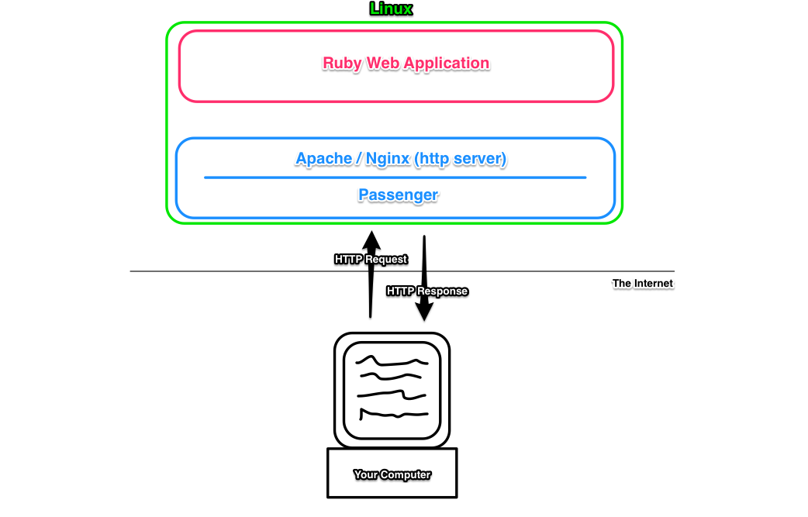

# HTTP 101

A computer network is a collection of computers and devices connected using communication devices (routers, cables, wifi).

Computers communicate over a network by sending data over the connection.

There are many types of networks and architectures, but we're going to look primarily at the internet and client/server architecture.

Client/Server
-------------

A **Server** is a computer that provides a service to clients.

A **Client** is a computer that requests services from a server (your web browser, an ATM, your phone)


Communication (HTTP)
-------------

Hypertext Transfer Protocol (HTTP) function as a request-response protocol.

A client sends an HTTP request and a server sends back an HTTP response.

Each of these are just text sent over our network. A series of technologies take this text, carry it to the intended destination, and make sense of it.

```rb
Socket.tcp("localhost", 3333) {|sock|
  sock.print "GET / HTTP/1.1\r\n\r\n"
  sock.close_write
  puts sock.read
}
```

#### Request
```
GET / HTTP/1.1
User-Agent: curl/7.30.0
Host: localhost:8080
Content-Length: 6
Accept: */*

order_item[product_id]=4
```

#### Response
```
HTTP/1.1 200 OK
Content-Type: text/html
Server: WEBrick/1.3.1 (Ruby/2.1.2/2014-05-08)
Date: Mon, 22 Sep 2014 19:19:57 GMT
Content-Length: 21
Connection: Keep-Alive

A barebones rack app
```


### Verbs

HTTP is minimum required data for a valid HTTP request is three things:
1. Verb (also called method which is confusing because it's not like a method in Ruby)
2. Path
3. HTTP version

### Verb

HTTP verbs allow the same URL to be used but to specify different action the user would like to take.


| Verb | Intent |
| :------------- | :------------- |
| GET | Retreive information, typically HTML |
| POST | Create information, typically writing a new record to a database |
| PATCH | Update information, typically modifying an existing record in a database |
| PUT | *same as PATCH* |
| DELETE | Remove information, typically deleting a record from a database |

The verb makes up the first portion of an HTTP request.

**GET** /profile HTTP/1.1

For example if we had a route defined in an application which is "/profile" (which is meant to represent the currently logged in user). A `GET` request to this URL would typically be used to get HTML to display to the user, most likely a dashboard showing their profile. Alternately a `DELETE` request could be made, this would typically delete the user or their profile.

### Path

The path is the most straightforward, this is like the location of the resource, before web apps this would actually be the path to a file, in the age of web apps, the HTML is dynamically generated and thus doesn't necessarily map directly to a single file.

GET **/profile** HTTP/1.1
### HTTP version.

We don't need to really worry about this one, it just tells the receiving server which version of HTTP to use, this servers can detect which version is being sent and handle it correctly.

GET /profile **HTTP/1.1**

Web Server
----------

The webserver is a running process on the server which monitors incoming HTTP requests
and respond with an HTTP response. In simpler times the web server would simply locate
an HTML file then read and return the contents. Remember when websites commonly had .html
at the end of the URL?

A webserver interfaces your application with incoming HTTP requests on the server.


